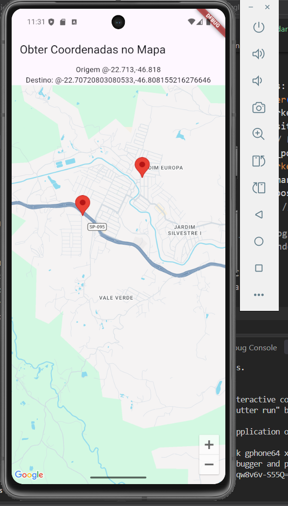

# Google Maps - Aula 05

Projeto desenvolvido em Flutter para a atividade de Mapas do SENAI.

## Google Maps Tutorial

O aplicativo apresenta um mapa utilizando o Google Maps e permite selecionar um ponto no mapa. Ao clicar em um local, são exibidas a latitude e a longitude do ponto selecionado.

## Funcionalidades

- Exibição do mapa
- Ponto de origem
- Seleção de um destino ao clicar no mapa
- Exibição da latitude e longitude
- Marcadores no mapa

## Tecnologias utilizadas

- Flutter
- Dart
- Google Maps
- Google Maps Flutter

## Teste no emulador

Aplicativo testado no emulador Android.

## APK

O arquivo APK está disponível na pasta `assets` deste projeto.